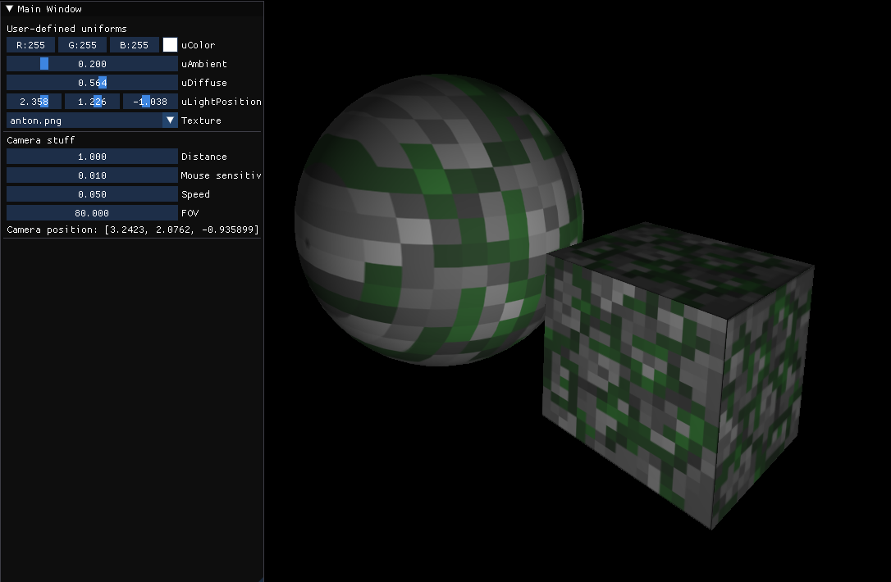

# Shaders Playground

A sandbox project for me to experiment with shaders.

It's tedious to do shaders in C or C++, because you will end up writing a lot more boilerplate or commenting lines in and out as you change the shader code. In a typical application, the uniforms will be bound by their names, for any new custom uniform a new imgui function call must be added and stuff like that. This distracted me when I did my [opengl_experiments](https://github.com/AntonC9018/opengl_experiments).

Now, in D, metaprogramming is a thing, and it's actually trivial to use. Via metaprogramming, the tediuos tasks can be simplified or entirely eliminated, which helps focus on the actual work — the shader code. Plus, D is a hell of a lot more enjoyable and simple than C++, and it compiles faster.

## Build Instructions

1. Install [DMD](https://dlang.org/download.html). Make sure to add it in PATH (it will prompt you on installation).
2. Clone this repo `git clone --recursive https://github.com/AntonC9018/shader_playground`.
3. To run, do `dub run`.

There are two "Apps" at the moment, contained in separate files next to `source/main.d`:
- `app.d` is a demo on textures and objects with an ambient diffuse lighting shader;
- `diagram.d` is a 3d visualization of national income data at `assets/income.csv`.

To change which app to run, you just need to instantiate the correct App class in main. 
Find the line `import xxx : App;` and replace `xxx` with the name of the file.

## Troubleshooting

While compiling, you may encounter issues with ImGui or GLFW. 
This probably means the libraries are not compatible with your OS.

For ImGui build-helper script, see [this](https://github.com/Superbelko/imgui-d). 
ImGui is linked statically, you'll need to replace `lib/imgui.lib` with the version of the library compiled for your OS.

For GLFW, download precompiled binaries [at their site](https://www.glfw.org/). 
It is linked dynamically, so put it in the bin folder.

Running the program may give you errors that your OpenGL version is too old. 
I'm not currently doing tesselation or compute shaders, so the application should work with OpenGL 3.0 or even older versions, 
but I'm not sure if it will without modifications, so you'll probably have to fiddle a little bit with the code to get it done.

Especially see the source files `shaderplayground/initialization.d` and the constant `SHADER_HEADER` in `shaderplayground/shadercommon.d`. 
I bet those might be problematic.
